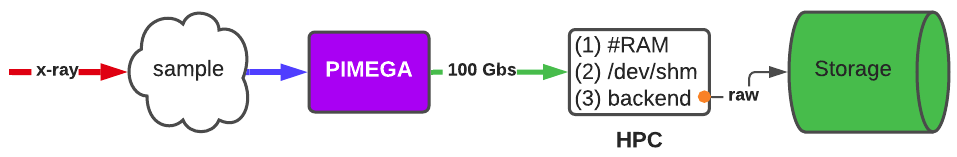
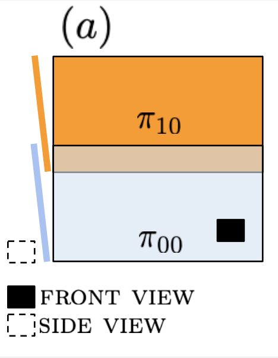
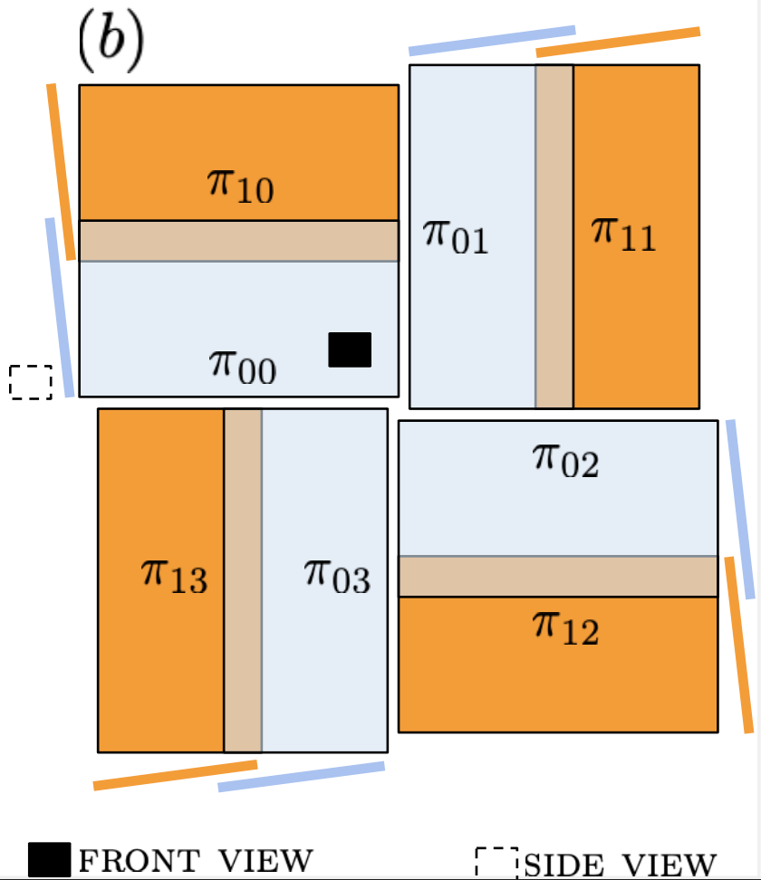

Definitions
===========

The flux of data for the pimega detector is presented in the Figure below. The default 
measurement process, collects all the data using the backend interface, 
storing the raw data at the central storage. By raw data, we mean the exact information
gathered by the pixels (in the row major order), and transmitted using the ethernet protocol 
to the high-performance computing node attached to this detector. Depending on the detector type
the digital matrix has to be corrected, so the final user could see the pattern under 
analysis. The process of transforming the unorservable measured raw data to an observable one is
called *restoration*. 

Hence, the *restoration* provided by this package acts in three different ways:

(1). *RAM*: 

        Data can be hold at the HPC random access memory. This action is useful when 
        live pre-processing is in action, and a sequence of restorations is needed for 
        further data processing. The typical case here is tomography, but the same applies to
        CDI, Ptychography, XPCS, among others. 

(2). *Shared Memory*: 

        Data can be hold at a shared memory folder '/dev/shm/' (at the local       
        HPC) so that further processing could be done. This is the case when 
        different data types (from Vortex, PCO, Pilatus) has to share the same
        experimental information, and a code for gathering all extra information
        can take place.

(3). *Storage*: 

        Loading stored pimega data requires a full restoration. The adopted policy between
        LNLS groups is that measured data goes to storage in the (compressed) HDF5 
        file format, with shape ``[:,:,:,:,:]``. Loading data in the compressed format could take 
        some time, depending on the number of images stored within the file. The scientific 
        computing group has an API called ``ssc-io``, which uses MPI to uncompress data, providing
        a Numpy final format for users.        

.. note:: For more informations about the detector and geometrical information about gaps, angles
          and the Medipix chip, please contact the LNLS Detectors group.

.. note:: The pimega backend software maintenace is provided by LNLS Tepui group.

        
NONPLANAR
*********

The geometrical definitions for the nonplanar pimega 135D and 540D are described in the
following :download:`document <LNLS_Pimega_Article.pdf>`.

.. note:: The mathematical description is not published yet. Be careful using this 
          document! For more informations, please contact eduardo.miqueles@lnls.br 

 
PLANAR
******

The geometrical definition for the planar pimega 135D and 540D is immediate. Taking
each stripe to have a normal vector pointing in the z-axis, eliminating the gaps 
and considering that all stripes have the same distance to the sample, we obtain 
a *virtual* image, restored in the same way as the nonplanar ones. Virtual images for 
the planar version of 540D can be easily obtained with a proper flag. Nevertheless, 
*real* images, where *real* means that we respect pixel size according to the geometry
between modules, can also be obtained. 

* In the case of a 3072x3072 digital unobservable raw data, the *real* restored digital
  matrix will have order :math:`n \times n`, with :math:`n > 3072`. This is due to the physical
  gap between modules. The exact value of :math:`n` depends on a proper optimization
  on the geometry (i.e., gaps) for this detector. 

STRIPES/MODULES
***************

A two-stripe generalization (for didactical purposes) for the projects 135D and 540D are 
presented in Figures (a) and (b). A stripe is also called *hexa*, which is a combination 
of 6 Medipix ASIC. Hence, a 135D detector has 6 *hexa*, whereas the 540D has 24 *hexa*. 
Stripes (or hexa) are listed from bottom to top. A 135D is composed from 6
hexa, each lying on a plane :math:`\pi_{j,k}`, with :math:`j` indicating the stripe and
:math:`k` the module. 

        Two-stripe generalization for the nonplanar pimega/135D 

        Two-stripe generalization for the nonplanar pimega/540D

.. note:: Throughout ``ssc-pimega``, modules for the pimega/540D (either nonplanar
          or planar) follows the clockwise notation:

          .. code-block:: bash
                
              Module 0 - top left
              Module 1 - top right
              Module 2 - bottom right
              Module 3 - bottom left

* For the nonplanar pimega/540D, each module is mathematically treated as a 
  nonplanar pimega/135D. Therefore, the orthonormal basis :math:`\{n, n^\perp, n^\times\}`
  is rotated by :math:`\theta=\pi/2` for module 1, by :math:`\theta=\pi` for module 2
  and :math:`\theta=3\pi/2` for module 3; all rotations with respect to the z-axis, with
  :math:`z` considered as the beam direction. 

